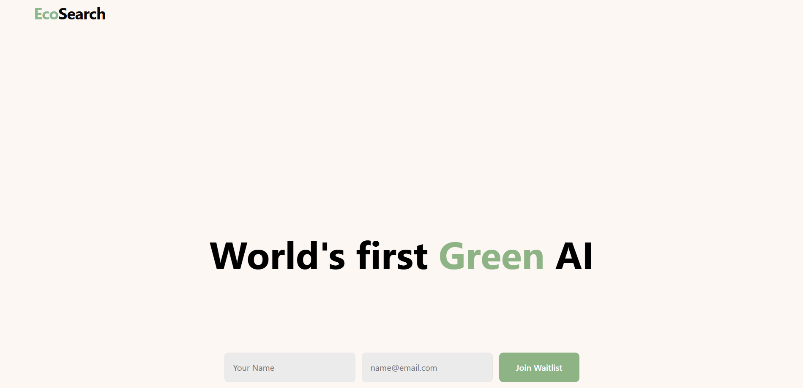

# EcoSearch Engine

EcoSearch Engine is a full-stack waitlist application built to collect and manage user registrations for the upcoming EcoSearch platform. This README provides comprehensive information about the project's architecture, design, workflow, and technical details.


*Note: Add your screenshot images to an 'images' folder in your repository*

## Table of Contents
- [Overview](#overview)
- [Features](#features)
- [Architecture](#architecture)
- [Tech Stack](#tech-stack)
- [Project Structure](#project-structure)
- [Database Schema](#database-schema)
- [Installation](#installation)
- [Development Workflow](#development-workflow)
- [Deployment](#deployment)
- [API Documentation](#api-documentation)
- [Contributing](#contributing)
- [License](#license)

## Overview

EcoSearch Engine is designed to build anticipation and collect user information prior to the full launch of the EcoSearch platform. The waitlist application provides a seamless user experience while capturing essential user data.


## Features

- **User Registration Form**: Collect user information for the waitlist
- **Email Validation**: Ensure valid email addresses are submitted
- **Confirmation System**: Provide users with confirmation after successful registration
- **Admin Dashboard**: Backend interface for managing waitlist entries
- **Responsive Design**: Optimized for both desktop and mobile devices
- **Data Storage**: Secure storage of user information in a PostgreSQL database

## Architecture

The application follows a modern full-stack architecture with clear separation of concerns:

```
┌─────────────┐     ┌─────────────┐     ┌─────────────┐
│   Client    │     │   Server    │     │  Database   │
│  (React)    │────▶│  (Node.js)  │────▶│ (PostgreSQL)│
└─────────────┘     └─────────────┘     └─────────────┘
```

### Client-Server Communication

- RESTful API endpoints for data exchange
- Form submissions handled asynchronously
- Server-side validation complementing client-side checks

### Data Flow

1. User submits waitlist form
2. Client validates input and sends to server
3. Server processes request and stores in database
4. Confirmation response sent back to client
5. Success message displayed to user

## Tech Stack

### Frontend
- **Framework**: React
- **Build Tool**: Vite
- **Styling**: Tailwind CSS
- **State Management**: React Hooks

### Backend
- **Runtime**: Node.js
- **Framework**: Express.js
- **API**: RESTful endpoints
- **TypeScript**: For type safety and better developer experience

### Database
- **SQL Database**: PostgreSQL
- **ORM**: Drizzle ORM for database interactions

### Development Tools
- **Package Manager**: npm
- **Version Control**: Git
- **Linting**: ESLint
- **Type Checking**: TypeScript

## Project Structure

```
EcoSearchEngine/
├── client/                 # Frontend code
│   ├── src/                # React components and logic
│   └── index.html          # HTML entry point
├── server/                 # Backend code
│   ├── index.ts            # Server entry point
│   ├── routes.ts           # API route definitions
│   ├── storage.ts          # Database operations
│   └── vite.ts             # Vite configuration for server
├── shared/                 # Shared code between client and server
│   └── schema.ts           # Database schema definitions
├── drizzle.config.ts       # Drizzle ORM configuration
├── package.json            # Project dependencies and scripts
├── tailwind.config.ts      # Tailwind CSS configuration
├── tsconfig.json           # TypeScript configuration
└── vite.config.ts          # Vite configuration for client
```

## Database Schema

The database schema is defined in `shared/schema.ts` using Drizzle ORM:

```typescript
// Example schema (simplified)
export const users = pgTable('waitlist_users', {
  id: serial('id').primaryKey(),
  email: text('email').notNull().unique(),
  name: text('name').notNull(),
  createdAt: timestamp('created_at').defaultNow(),
  // Additional fields as needed
});
```

## Installation

1. Clone the repository:
   ```bash
   git clone https://github.com/SakshamChouhan/EcoSearch-Backend.git
   cd EcoSearch-Backend
   ```

2. Install dependencies:
   ```bash
   npm install
   ```

3. Set up environment variables:
   ```bash
   # Create .env file with the following variables
   DATABASE_URL=your_postgres_connection_string
   PORT=3000
   # Add any other required environment variables
   ```

4. Run the development server:
   ```bash
   node dist/index.js
   ```

## Development Workflow

1. **Local Development**:
   - Run `npm run dev` to start both client and server in development mode
   - Client will be available at `http://localhost:5173`
   - Server API will be available at `http://localhost:3000`

2. **Database Migrations**:
   - Use Drizzle Kit to manage database migrations
   - Run `npx drizzle-kit push:pg` to apply schema changes

3. **Building for Production**:
   - Run `npm run build` to build both client and server
   - The built files will be in the `dist` directory

## Deployment

The application is deployed on Render:

1. **Backend Deployment**:
   - Build command: `npm install && npm run build`
   - Start command: `node dist/index.js`
   - Environment variables: Set all required variables in the Render dashboard

2. **Frontend Deployment**:
   - The frontend is served by the backend server in production
   - Static assets are served from the `dist/public` directory

3. **Database**:
   - Production database is hosted on a PostgreSQL service
   - Connection string is provided via environment variables

## API Documentation

### Endpoints

#### User Registration
- **POST /api/waitlist**
  - Description: Register a new user for the waitlist
  - Request Body:
    ```json
    {
      "email": "user@example.com",
      "name": "John Doe",
      "referralSource": "Twitter"
    }
    ```
  - Response: 
    ```json
    {
      "success": true,
      "message": "Successfully added to waitlist",
      "userId": 123
    }
    ```

#### Get Waitlist Count
- **GET /api/waitlist/count**
  - Description: Get the current number of users on the waitlist
  - Response:
    ```json
    {
      "count": 1500
    }
    ```

## Contributing

1. Fork the repository
2. Create a feature branch: `git checkout -b feature-name`
3. Commit your changes: `git commit -m 'Add some feature'`
4. Push to the branch: `git push origin feature-name`
5. Submit a pull request

## License

This project is licensed under the MIT License - see the LICENSE file for details.

## CodeLikeRed❤️
